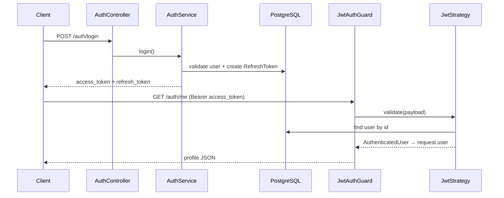

# NestJS Learning 2026

REST API สำหรับเรียนรู้ NestJS แบบ production-ready ใช้ Feature-based module, Prisma ORM, JWT Authentication พร้อม Refresh Token และ Role-Based Access Control (RBAC)

เอกสารนี้ออกแบบให้ทั้งคนที่คุ้น NestJS และคนที่เพิ่งเริ่ม — มีส่วนอธิบาย **Request Lifecycle**, **การทำงานของ Auth**, และ **โครงสร้างโปรเจกต์** แยกไว้ชัดเจน

---

## สารบัญ

- [Tech Stack](#tech-stack)
- [Features](#features)
- [Fork โปรเจกต์ใหม่](FORK.md)
- [สำหรับผู้เริ่มต้น NestJS](#สำหรับผู้เริ่มต้น-nestjs)
- [Request Lifecycle](#request-lifecycle-ลำดับการทำงานของ-request)
- [Authentication & Authorization Flow](#authentication--authorization-flow)
- [Project Structure](#project-structure)
- [Getting Started](#getting-started)
- [API Reference](#api-reference)
- [Decorators](#decorators)
- [Error Response](#error-response)
- [Database Schema](#database-schema)
- [Environment Variables](#environment-variables-reference)
- [Prisma Commands](#prisma-commands)
- [Scripts](#scripts)

---

## Tech Stack

| หมวด | เทคโนโลยี |
|------|-----------|
| Framework | [NestJS 11](https://nestjs.com/) + TypeScript |
| Database | PostgreSQL 17 |
| ORM | [Prisma 7](https://www.prisma.io/) |
| Validation | [Zod](https://zod.dev/) + [nestjs-zod](https://github.com/BenLorantfy/nestjs-zod) |
| Auth | JWT + Passport.js + bcrypt |
| API Docs | Swagger (`/api`) |
| Security | Helmet |

---

## Features

- **Authentication** — Login, Refresh Token (rotation), Logout
- **Authorization** — Global JWT Guard + Role Guard (`USER`, `ADMIN`, `MANAGER`)
- **Public API** — Decorator `@Public()` สำหรับ route ที่ไม่ต้อง auth
- **User Management** — Register, CRUD, Soft delete, Pagination + Search
- **Global Exception Filter** — Error response รูปแบบเดียวกันทั้ง API
- **HTTP Request Logging** — log method, path, status, duration
- **Docker** — PostgreSQL ผ่าน Docker Compose
- **CORS** — ตั้งค่าผ่าน `CORS_ORIGIN` (default localhost สำหรับ dev)
- **Env validation** — ตรวจสอบตัวแปรสภาพแวดล้อมตอน boot (Zod, fail fast)
- **Prisma lifecycle** — `$connect` / `$disconnect` ตาม module lifecycle
- **Fork-ready** — [FORK.md](./FORK.md) checklist + `pnpm run db:setup` สำหรับ setup หลัง fork

---

## สำหรับผู้เริ่มต้น NestJS

### NestJS คืออะไร?

NestJS เป็น **Node.js framework** ที่ใช้โครงสร้างแบบ **Module → Controller → Service**:

| ชั้น | หน้าที่ | ตัวอย่างในโปรเจกต์ |
|------|---------|-------------------|
| **Module** | รวมส่วนที่เกี่ยวข้อง (DI container) | `AuthModule`, `UserModule` |
| **Controller** | รับ HTTP request, เรียก service, ส่ง response | `AuthController`, `UserController` |
| **Service** | Business logic, คุยกับ database | `AuthService`, `UserService` |
| **Provider** | class ที่ inject ได้ (service, guard, strategy) | `PrismaService`, `JwtStrategy` |

### Dependency Injection (DI)

Nest สร้าง instance ให้และ **inject** เข้า constructor อัตโนมัติ:

```typescript
@Injectable()
export class UserService {
  constructor(private readonly prisma: PrismaService) {}
}
```

ไม่ต้อง `new PrismaService()` เอง — Nest จัดการให้

### Global vs Route-level

ใน `app.module.ts` มีการตั้งค่าแบบ **global** (มีผลทุก route):

- `JwtAuthGuard` — ทุก route ต้องมี JWT ยกเว้น `@Public()`
- `ZodValidationPipe` — validate body/query
- `GlobalExceptionFilter` — จับ error ทั้งหมด

### แผนภาพ Module

```
AppModule
├── ConfigModule (global)
├── PrismaModule (global) ──► PrismaService
├── AuthModule
│   ├── AuthController
│   ├── AuthService
│   └── JwtStrategy
└── UserModule
    ├── UserController
    └── UserService ──► ใช้ PrismaService
```

---

## Request Lifecycle (ลำดับการทำงานของ Request)

เมื่อ client ส่ง HTTP request เข้ามา NestJS ประมวลผลตามลำดับนี้ (จาก [NestJS Lifecycle](https://docs.nestjs.com/faq/request-lifecycle)):

```
1. Middleware          (เช่น helmet, HTTP logger ใน main.ts)
        ↓
2. Guards              (JwtAuthGuard → RolesGuard ถ้ามี)
        ↓
3. Interceptors (ก่อน) (ZodSerializerInterceptor)
        ↓
4. Pipes               (ZodValidationPipe — validate input)
        ↓
5. Controller Handler  (@Body, @Param, @CurrentUser, ...)
        ↓
6. Interceptors (หลัง)
        ↓
7. Response ออกไป
```

### ลำดับ Guard หลายตัว

| ลำดับ | Guard | ลงทะเบียนที่ |
|-------|-------|--------------|
| 1 | `JwtAuthGuard` | `APP_GUARD` ใน `app.module.ts` (Global) |
| 2 | `RolesGuard` | `@Auth(...roles)` บน route เฉพาะ |

**Global Guard รันก่อน Route Guard เสมอ** — ดังนั้น JWT ต้องผ่านก่อน แล้วค่อยเช็ค role

### ตัวอย่าง: `GET /auth/me`

```
Client ส่ง Authorization: Bearer <access_token>
    ↓
JwtAuthGuard
    → Passport อ่าน JWT จาก header
    → verify signature + expiry
    → เรียก JwtStrategy.validate(payload)  ← Passport เรียกให้เอง (ไม่มีในโค้ดเรา)
    → query user จาก DB ด้วย payload.sub
    → ใส่ผลลัพธ์ลง request.user
    ↓
getProfile(@CurrentUser() user)
    → อ่าน request.user ที่ guard เตรียมไว้แล้ว
    ↓
Response JSON
```

### `validate()` ถูกเรียกเมื่อไหร่?

`JwtStrategy.validate()` **ไม่ได้ถูกเรียกจาก controller โดยตรง** แต่ถูกเรียกโดย **Passport** ภายใน `JwtAuthGuard`:

```
JwtAuthGuard (extends PassportAuthGuard('jwt'))
    → passport.authenticate('jwt')
    → passport-jwt verify token → ได้ payload object
    → JwtStrategy.validate(payload)
    → return value → request.user
```

`payload` คือข้อมูลที่ถอดจาก JWT (สร้างตอน login ด้วย `jwtService.signAsync({ sub, email, role })`)

---

## Authentication & Authorization Flow

### Token คู่

| Token | อายุ | เก็บที่ไหน | ใช้ทำอะไร |
|-------|------|------------|-----------|
| **access_token** | สั้น (default `1h`) | Client เก็บเอง | ส่งใน header `Authorization: Bearer ...` ทุก protected API |
| **refresh_token** | ยาว (default `7d`) | Client เก็บเอง | ใช้กับ `/auth/refresh` และ `/auth/logout` เท่านั้น |

Refresh token ถูก **hash (SHA-256)** ก่อนเก็บใน DB — ไม่เก็บ plain text

### Flow สรุป

```
Login     → access_token + refresh_token
Refresh   → token คู่ใหม่ + revoke refresh เก่า (rotation)
Logout    → revoke refresh_token ใน DB
```

### Sequence: Login → เรียก Protected API



### Role (RBAC)

| Role | ตัวอย่างสิทธิ์ในโปรเจกต์ |
|------|-------------------------|
| `USER` | ผู้ใช้ทั่วไป |
| `MANAGER` | ดูรายการ user (`GET /user`) |
| `ADMIN` | ดูรายการ user (`GET /user`) |

Route ที่ใส่ `@Auth(ADMIN, MANAGER)` ต้อง **login แล้ว** และ **role ตรง** มิฉะนั้นได้ `403 Forbidden`

---

## Project Structure

```
src/
├── main.ts                      # Bootstrap: helmet, Swagger, HTTP logger
├── app.module.ts                # Root module + global providers
├── app.controller.ts              # GET / (health/hello)
│
├── auth/
│   ├── auth.module.ts           # JWT + Passport setup
│   ├── auth.controller.ts       # /auth/*
│   ├── auth.service.ts          # login, refresh, logout logic
│   ├── hash-password.ts         # bcrypt hash/compare
│   ├── refresh-token.util.ts    # generate + hash refresh token
│   ├── strategies/
│   │   └── jwt.strategy.ts      # verify JWT → load user → request.user
│   └── dto/
│
├── features/
│   └── user/
│       ├── user.module.ts
│       ├── user.controller.ts   # /user/*
│       ├── user.service.ts      # register, CRUD, pagination
│       └── dto/
│
├── common/
│   ├── config/
│   │   ├── configuration.ts     # env → config object
│   │   └── http-exception.filter.ts
│   ├── decorators/
│   │   ├── public.decorator.ts  # @Public()
│   │   ├── auth.decorator.ts    # @Auth(...roles)
│   │   └── current-user.decorator.ts
│   ├── guard/
│   │   ├── jwtAuthGuard.guard.ts
│   │   └── roles.guard.ts
│   ├── prisma/
│   │   ├── prisma.module.ts     # @Global()
│   │   └── prisma.service.ts
│   ├── dto/                     # pagination, paginated response
│   ├── schemas/                 # Zod base schemas
│   ├── types/                   # JwtPayload, AuthenticatedUser
│   └── utils/
│       └── prisma-paginate.util.ts
│
└── generated/prisma/            # Prisma Client (auto-generated — ห้ามแก้มือ)

prisma/
├── schema.prisma
└── migrations/
```

---

## Getting Started

> **Fork จาก repo นี้ไปโปรเจกต์ใหม่?** ดู checklist ที่ **[FORK.md](./FORK.md)** (เปลี่ยน `JWT_SECRET`, ชื่อ DB, seed, Swagger title ฯลฯ)

### Prerequisites

- [Node.js](https://nodejs.org/) >= 20
- [pnpm](https://pnpm.io/)
- [Docker](https://www.docker.com/) (สำหรับ PostgreSQL)

### 1. Clone & Install

```bash
git clone <repository-url>
cd nestjs-learning-2026
pnpm install
```

### 2. Environment Variables

```bash
cp .env.example .env
```

แก้ค่าใน `.env` ให้ตรงกับโปรเจกต์ — โดยเฉพาะ `JWT_SECRET` และ `DATABASE_URL` / `DB_*` (รายละเอียดตัวแปรดูที่ [Environment Variables](#environment-variables-reference))

### 3. Database (ครั้งแรก)

**แบบรวดเดียว** — เปิด PostgreSQL, apply migrations, seed:

```bash
pnpm run db:setup
```

คำสั่งนี้รัน `db:up` → รอ DB พร้อม → `db:migrate` → `db:seed`

**แบบแยกขั้น** (ถ้าต้องการควบคุมเอง):

```bash
pnpm run db:up          # docker compose up -d
pnpm run db:migrate     # prisma migrate deploy
pnpm run db:seed        # ข้อมูลตัวอย่าง dev
```

เมื่อแก้ `prisma/schema.prisma` แล้วต้องการสร้าง migration ใหม่ (development):

```bash
npx prisma migrate dev --name <migration_name>
npx prisma generate
```

หลัง seed สามารถ login ได้ทันที (รันซ้ำได้ — จะลบแล้วสร้างผู้ใช้ชุดเดิมใหม่):

| Email | Password | Role |
|-------|----------|------|
| `tetsuya@test.com` | `tetsuya` | ADMIN |
| `john.doe@example.com` | `password123` | USER |
| `jane.smith@example.com` | `password123` | MANAGER |
| `alex.wong@example.com` | `password123` | USER |
| `maria.garcia@example.com` | `password123` | USER |

### 4. Run Application

```bash
# Development (watch mode)
pnpm run start:dev

# Production
pnpm run build
pnpm run start:prod
```

| URL | คำอธิบาย |
|-----|----------|
| `http://localhost:5555` | API base |
| `http://localhost:5555/api` | Swagger UI |

---

## API Reference

### Auth

| Method | Path | Auth | คำอธิบาย |
|--------|------|------|----------|
| `POST` | `/auth/login` | Public | Login |
| `POST` | `/auth/refresh` | Public | Refresh token (rotation) |
| `POST` | `/auth/logout` | Public | Logout (revoke refresh token) |
| `GET` | `/auth/me` | Bearer | ดู profile ตัวเอง |

**Login**

```bash
curl -X POST http://localhost:5555/auth/login \
  -H "Content-Type: application/json" \
  -d '{"email": "tetsuya@test.com", "password": "tetsuya"}'
```

```json
{
  "access_token": "eyJhbG...",
  "refresh_token": "a1b2c3...",
  "user": {
    "id": "uuid",
    "email": "user@example.com",
    "first_name": "John",
    "last_name": "Doe",
    "role": "USER"
  }
}
```

**เรียก Protected API**

```bash
curl http://localhost:5555/auth/me \
  -H "Authorization: Bearer <access_token>"
```

**Refresh Token**

```bash
curl -X POST http://localhost:5555/auth/refresh \
  -H "Content-Type: application/json" \
  -d '{"refresh_token": "<refresh_token>"}'
```

**Logout**

```bash
curl -X POST http://localhost:5555/auth/logout \
  -H "Content-Type: application/json" \
  -d '{"refresh_token": "<refresh_token>"}'
```

### User

| Method | Path | Auth | Role | คำอธิบาย |
|--------|------|------|------|----------|
| `POST` | `/user` | Public | — | Register (สร้าง user + address) |
| `GET` | `/user` | Bearer | ADMIN, MANAGER | List users (pagination) |
| `GET` | `/user/:id` | Bearer | — | Get user by ID |
| `PATCH` | `/user/:id` | Bearer | — | Update user |
| `DELETE` | `/user/:id` | Bearer | — | Soft delete |

> `GET/PATCH/DELETE /user/:id` ต้อง login แต่ **ยังไม่จำกัด role** — ใคร login ก็เรียกได้ (ออกแบบสำหรับเรียนรู้; production อาจเพิ่ม `@Auth()`)

**Register**

```bash
curl -X POST http://localhost:5555/user \
  -H "Content-Type: application/json" \
  -d '{
    "email": "new@example.com",
    "password": "password123",
    "first_name": "Jane",
    "last_name": "Doe",
    "address": {
      "address": "123 Main St",
      "city": "Bangkok",
      "state": "Bangkok",
      "zip": "10110",
      "country": "Thailand"
    }
  }'
```

### Pagination (`GET /user`)

```
GET /user?page=1&limit=10&search=john&sort=created_at&order=desc
```

| Param | Type | Default | คำอธิบาย |
|-------|------|---------|----------|
| `page` | number | — | หน้าที่ต้องการ (ไม่ส่ง = คืนทั้งหมดไม่มี meta) |
| `limit` | number | `10` | จำนวนต่อหน้า (เมื่อมี `page`) |
| `search` | string | — | ค้นหาใน `first_name`, `last_name`, `email` |
| `sort` | string | `created_at` | ฟิลด์: `first_name`, `last_name`, `email`, `created_at` |
| `order` | `asc` \| `desc` | `desc` | ทิศทาง sort |

Response แบบมี pagination:

```json
{
  "data": [...],
  "count": 100,
  "page": 1,
  "limit": 10,
  "totalPages": 10
}
```

---

## Decorators

### `@Public()`

ข้าม `JwtAuthGuard` — route ไม่ต้องส่ง Bearer token

```typescript
@Public()
@Post('login')
login() { ... }
```

### `@Auth(...roles)`

ใช้ร่วมกับ Global JWT Guard:

1. ต้อง login (JWT ผ่าน)
2. `RolesGuard` เช็ค `request.user.role`

```typescript
@Auth(USER_ROLE.ADMIN, USER_ROLE.MANAGER)
@Get()
findAll() { ... }
```

### `@CurrentUser()`

ดึง `request.user` ที่ `JwtStrategy.validate()` ใส่ไว้แล้ว — **ไม่ได้ decode JWT ใน decorator**

```typescript
@Get('me')
getProfile(@CurrentUser() user: AuthenticatedUser) {
  return this.authService.getProfile(user);
}
```

---

## Error Response

ทุก error ผ่าน `GlobalExceptionFilter` ได้รูปแบบ:

```json
{
  "statusCode": 400,
  "message": ["รายละเอียด error"],
  "timestamp": "2026-05-20T10:00:00.000Z"
}
```

| สถานการณ์ | status | หมายเหตุ |
|-----------|--------|----------|
| Validation (Zod) | 400 | `message` เป็น array ของ `{ field, error }` |
| Unauthorized | 401 | JWT ไม่ถูก / หมดอายุ |
| Forbidden | 403 | role ไม่ตรง |
| Not found (Prisma P2025) | 404 | ข้อความภาษาไทย |
| Server error | 500 | log ใน server |

---

## Database Schema

```
User ──┬── Address (1:1)
       └── RefreshToken (1:N)

USER_ROLE: USER | ADMIN | MANAGER
```

- **Soft delete** — `DELETE /user/:id` ตั้ง `deleted_at` + `isActive: false` ไม่ลบ row จริง
- **Password** — hash ด้วย bcrypt (10 salt rounds)

---

## Environment Variables Reference

ตัวอย่างค่าทั้งหมดอยู่ใน [`.env.example`](./.env.example)

| Variable | Required | Default | คำอธิบาย |
|----------|----------|---------|----------|
| `DATABASE_URL` | ✅ | — | PostgreSQL connection string |
| `DB_USER` | — | — | ใช้กับ Docker Compose |
| `DB_PASSWORD` | — | — | ใช้กับ Docker Compose |
| `DB_NAME` | — | — | ใช้กับ Docker Compose |
| `DB_HOST` | — | `localhost` | Database host (ใน configuration) |
| `DB_PORT` | — | `5432` | Database port |
| `JWT_SECRET` | ✅ | `change-me-in-production` | Secret สำหรับ sign/verify JWT |
| `JWT_EXPIRES_IN` | — | `1h` | อายุ access token |
| `JWT_REFRESH_EXPIRES_IN` | — | `7d` | อายุ refresh token (`7d`, `24h`, `30m`) |
| `PORT` | — | `5555` | Port ของ API server |
| `NODE_ENV` | — | `development` | `development` \| `production` \| `test` |
| `CORS_ORIGIN` | production | — | Allowed origins คั่นด้วย comma (บังคับใน production) |

---

## Prisma Commands

```bash
# GUI จัดการ database
npx prisma studio

# Apply migrations ที่มีอยู่แล้ว (ใช้ใน db:setup / CI)
pnpm run db:migrate

# สร้าง migration ใหม่หลังแก้ schema (development)
npx prisma migrate dev --name <migration_name>

# Generate client หลังแก้ schema
npx prisma generate
```

---

## Scripts

| คำสั่ง | คำอธิบาย |
|--------|----------|
| `pnpm run db:setup` | เปิด DB + migrate + seed (setup ครั้งแรก) |
| `pnpm run db:up` | เปิด PostgreSQL ผ่าน Docker Compose |
| `pnpm run db:migrate` | Apply migrations (`prisma migrate deploy`) |
| `pnpm run db:seed` | ใส่ข้อมูลตัวอย่าง (`prisma db seed`) |
| `pnpm run start:dev` | Dev server (hot reload) |
| `pnpm run build` | Build โปรเจกต์ |
| `pnpm run start:prod` | รัน production build |
| `pnpm run lint` | ESLint |
| `pnpm run test` | Unit tests |
| `pnpm run test:e2e` | E2E tests |
| `pnpm run test:cov` | Test coverage |

---

## แนวทางพัฒนาเพิ่ม Feature ใหม่

1. แก้ `prisma/schema.prisma` แล้ว `npx prisma migrate dev`
2. สร้างโฟลเดอร์ `src/features/<feature>/` (module, controller, service, dto)
3. import module ใน `app.module.ts`
4. ใช้ `PrismaService` inject ใน service (ได้จาก global `PrismaModule`)
5. กำหนด `@Public()` / `@Auth()` ตามความต้องการ
6. สร้าง Zod DTO ด้วย `createZodDto` + `@ZodSerializerDto` สำหรับ response

---

## License

UNLICENSED — Private project
